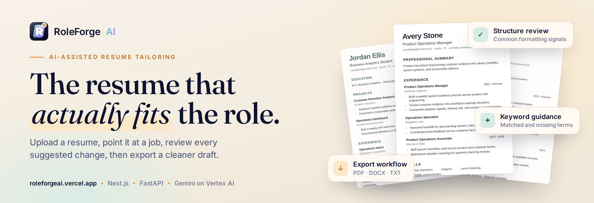
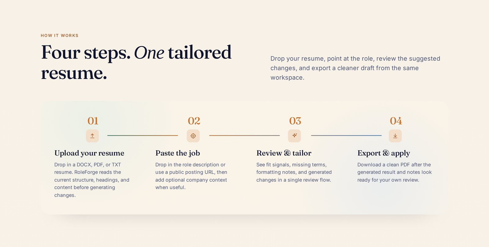
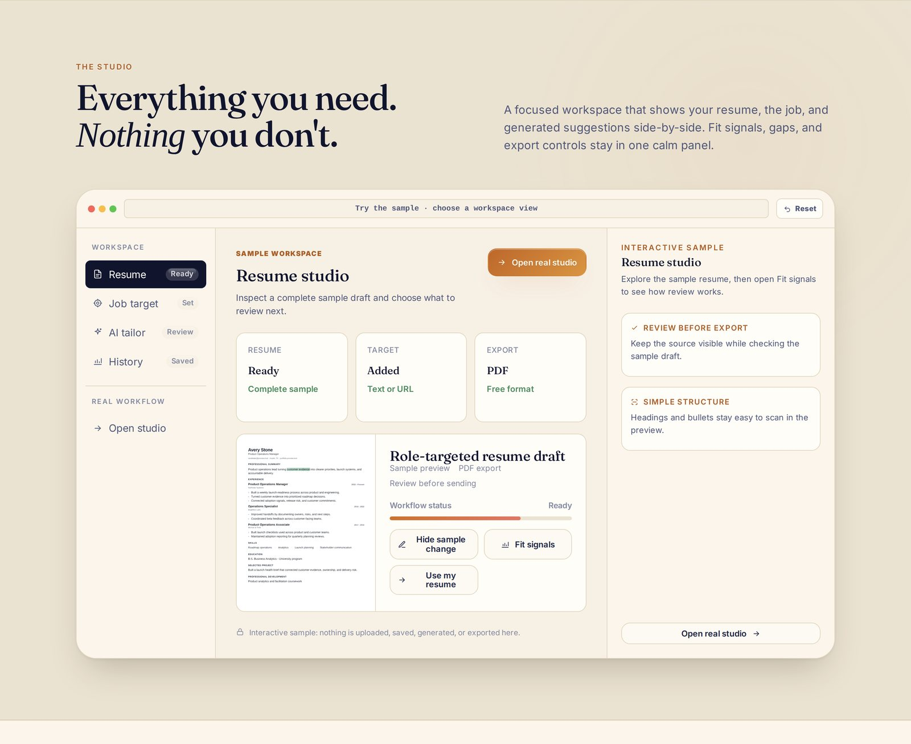
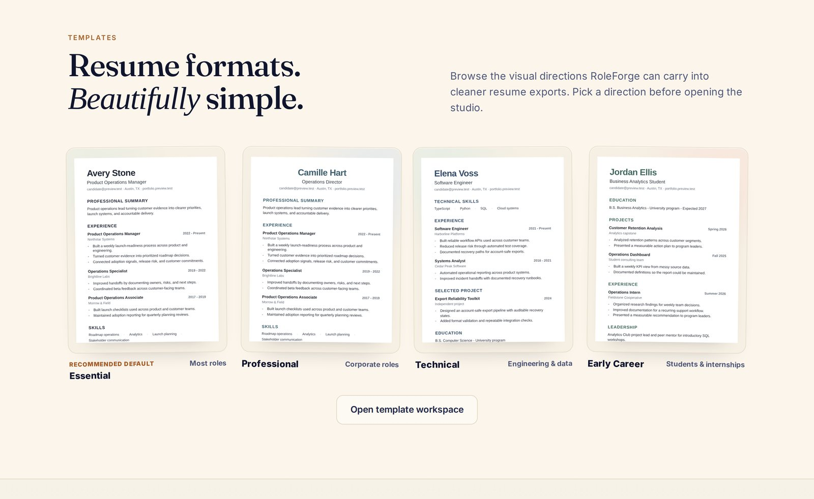
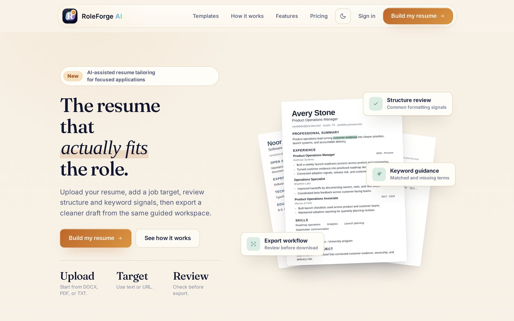
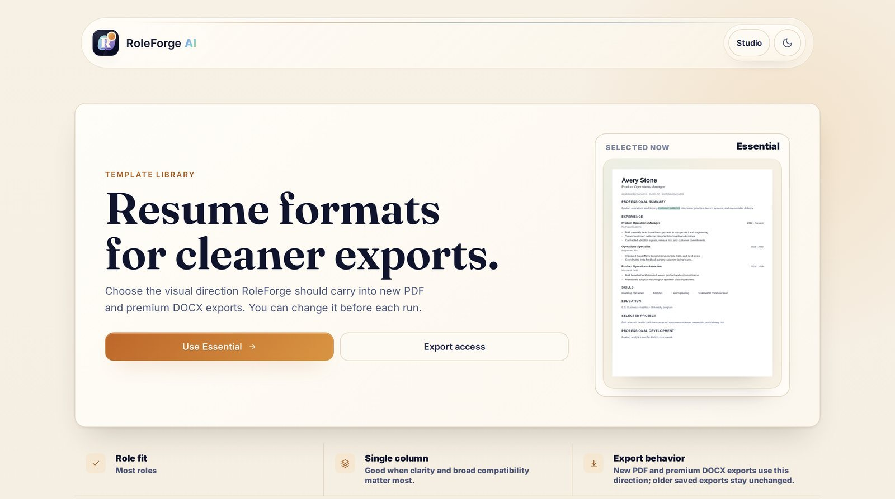
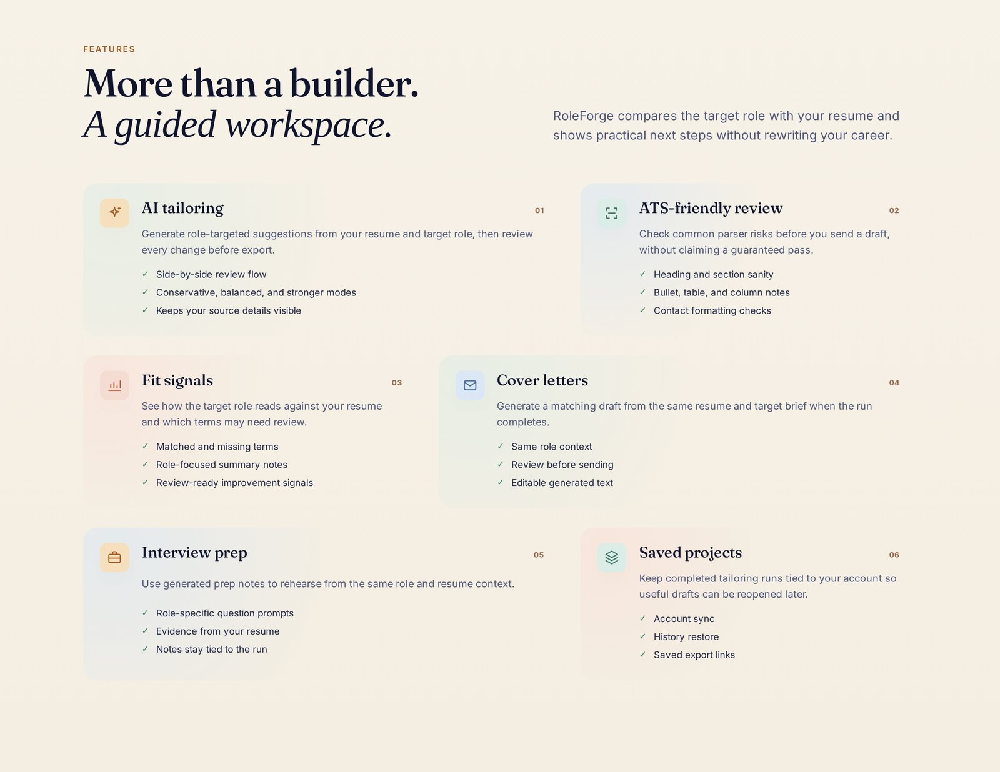
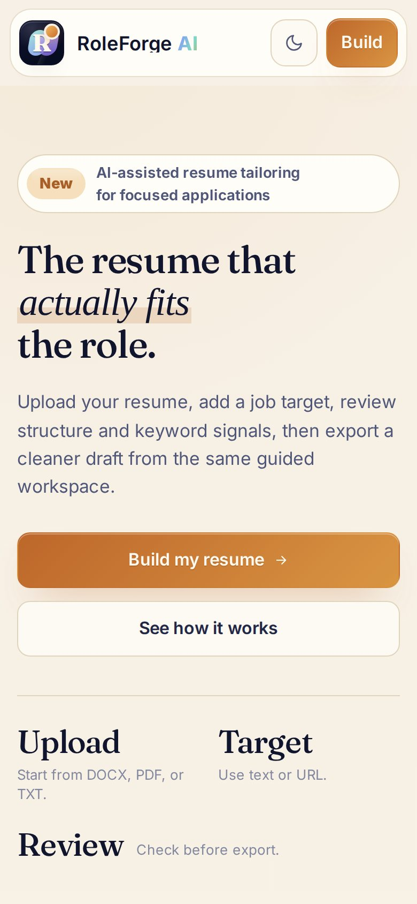
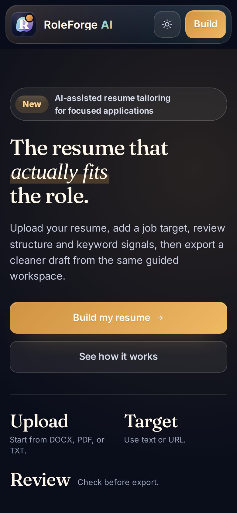
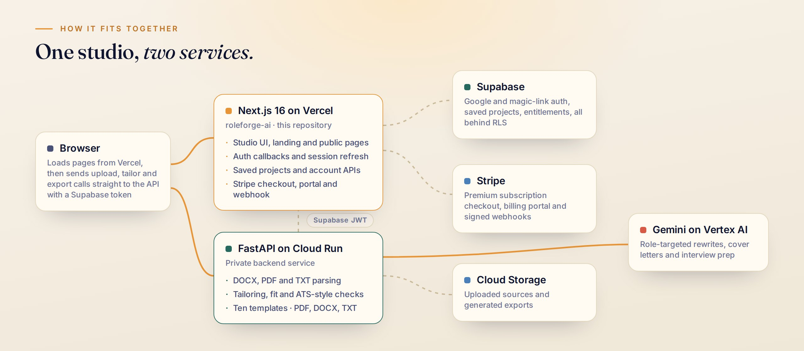

<a href="https://roleforgeai.vercel.app">
  <picture>
    <source media="(prefers-color-scheme: dark)" srcset="docs/brand/banner-dark.jpg">
    <source media="(prefers-color-scheme: light)" srcset="docs/brand/banner-light.jpg">
    
  </picture>
</a>

<p align="center">
  <a href="https://roleforgeai.vercel.app"><b>Open RoleForge</b></a>
  &nbsp;·&nbsp;
  <a href="https://roleforgeai.vercel.app/templates">Template library</a>
  &nbsp;·&nbsp;
  <a href="https://roleforgeai.vercel.app/status">Live status</a>
  &nbsp;·&nbsp;
  <a href="docs/development.md">Developer guide</a>
</p>

<p align="center">
  <a href="https://github.com/agrovr/roleforge-ai/actions/workflows/ci.yml"></a>
  <a href="https://github.com/agrovr/roleforge-ai/actions/workflows/production-smoke.yml"></a>
  
  
  
</p>

---

**RoleForge AI** is a resume-tailoring studio. Upload the resume you already have, point it at a
job posting, and RoleForge drafts a version aimed at that role, shows you which terms match and
which are missing, flags formatting that parsers tend to trip on, and lets you review every change
before you export a clean PDF, DOCX or TXT.

It won't invent employers, titles, dates or metrics: when the evidence isn't in your resume, it
becomes a suggestion instead of a line on the page. It doesn't promise an ATS score either. The
source resume stays visible next to every change, so you decide what ships.

## How it works

<picture>
  <source media="(prefers-color-scheme: dark)" srcset="docs/screens/how-dark.jpg">
  
</picture>

1. **Upload** a DOCX, PDF or TXT resume. RoleForge reads its structure, headings and content.
2. **Target** a role by pasting the job description or a public posting URL, with optional company
   context.
3. **Review** fit signals, matched and missing terms, formatting notes and the generated rewrite in
   one side-by-side flow.
4. **Export** in the template you picked, then reopen the run later from your saved projects.

## The studio

<picture>
  <source media="(prefers-color-scheme: dark)" srcset="docs/screens/studio-dark.jpg">
  
</picture>

| | |
| :-- | :-- |
| **AI tailoring** | Role-targeted suggestions in conservative, balanced or stronger modes, each reviewed before export. |
| **Fit signals** | How the posting reads against your resume: matched terms, missing terms and summary notes. |
| **ATS-friendly review** | Heading, section, bullet, table, column and contact-format checks, without claiming a guaranteed pass. |
| **Cover letters and interview prep** | Drafted from the same resume and role, so the story stays consistent. |
| **Saved projects** | Signed-in runs sync to your account, with rename, restore and saved export links. |
| **Light and dark** | Both themes, chosen per device and remembered. |

## Templates

<picture>
  <source media="(prefers-color-scheme: dark)" srcset="docs/screens/templates-dark.jpg">
  
</picture>

Ten export templates, from **Essential** (the single-column default) and **Professional** to
**Technical**, **Early Career**, **Career Pivot**, **Academic** and **Impact**. The
[template library](https://roleforgeai.vercel.app/templates) previews each one in full and lets you
filter by use case before you open the studio.

<details>
<summary><b>More screens</b></summary>
<br>

<table>
  <tr>
    <td width="50%">
      <picture>
        <source media="(prefers-color-scheme: dark)" srcset="docs/screens/hero-dark.jpg">
        
      </picture>
      <p align="center"><sub>Landing page</sub></p>
    </td>
    <td width="50%">
      <picture>
        <source media="(prefers-color-scheme: dark)" srcset="docs/screens/template-library-dark.jpg">
        
      </picture>
      <p align="center"><sub>Template library</sub></p>
    </td>
  </tr>
  <tr>
    <td colspan="2">
      <picture>
        <source media="(prefers-color-scheme: dark)" srcset="docs/screens/features-dark.jpg">
        
      </picture>
      <p align="center"><sub>Feature overview</sub></p>
    </td>
  </tr>
</table>

<p align="center">
  
  &nbsp;&nbsp;
  
</p>

</details>

## Plans

| | Studio (free) | Premium |
| :-- | :-- | :-- |
| Tailoring runs | 5 per month | Unlimited |
| Upload | DOCX, PDF, TXT | DOCX, PDF, TXT |
| Export | PDF | PDF, DOCX, TXT |
| Saved projects | Yes | Yes |

Billing runs through Stripe, and plans are managed from Settings. See
[plan rules](docs/plan-rules.md) for the exact entitlement logic.

## Architecture

<picture>
  <source media="(prefers-color-scheme: dark)" srcset="docs/brand/architecture-dark.jpg">
  
</picture>

This repository is the **web app**: the landing and public pages, the studio UI, auth callbacks,
saved-project and account APIs, and Stripe billing. Document parsing, AI tailoring and file
rendering live in a separate FastAPI service on Google Cloud Run, which checks every request
against the user's Supabase session.

| Layer | Built with |
| :-- | :-- |
| Web app | Next.js 16 (App Router), React 19, TypeScript, Tailwind CSS 4 with hand-written CSS |
| Accounts | Supabase Auth (Google OAuth and email magic links), Postgres with row-level security |
| Billing | Stripe Checkout, Customer Portal and signed webhooks |
| AI and documents | FastAPI, Gemini on Vertex AI, Cloud Storage, DOCX/PDF/TXT parsers and renderers |
| Hosting | Vercel (web), Cloud Run (API), Vercel Analytics |

```text
app/
  page.tsx            landing page
  app/                the resume studio (protected)
  templates/          template library
  api/                saved runs, account, billing, auth status, downloads
  auth/               OAuth start, magic link, callback, sign-out
  settings/ support/ status/ help/ updates/ privacy/ terms/
  components/         brand, icons, resume previews, studio demo, theme toggle
  lib/                typed helpers with unit tests beside them
proxy.ts              refreshes Supabase session cookies
supabase/migrations/  schema, RLS policies and grants
scripts/              smoke tests, readiness audits and support tooling
docs/                 developer guide, runbook, billing and plan rules, README art
```

## Quality and operations

- **CI** runs unit tests, ESLint, a strict typecheck and a production build on every push and pull
  request.
- **After each deploy** to `main`, CI waits for Vercel, then smoke-tests production as a signed-in
  test user: the studio shell, a saved-project round trip, export and download through the API,
  and rendered layouts in headless Chrome.
- **Every day**, a scheduled workflow repeats the production smoke.
- **The public [status page](https://roleforgeai.vercel.app/status)** checks the API's readiness
  each time it renders.

## Run it locally

```bash
npm ci
cp .env.example .env.local
npm run dev        # http://localhost:3000
```

The landing page and template library work without any services. The studio needs Supabase and the
API; the [developer guide](docs/development.md) covers environment variables, auth setup, the API
contract and every check script.

| Script | What it does |
| :-- | :-- |
| `npm run dev` | Development server |
| `npm test` | Unit tests |
| `npm run lint` / `npm run typecheck` | ESLint and `tsc --noEmit` |
| `npm run build` | Production build |
| `npm run smoke:frontend` | Smoke-test a deployment (production by default) |

## Documentation

| Doc | For |
| :-- | :-- |
| [Developer guide](docs/development.md) | Local setup, environment variables, auth, API contract, checks |
| [Operations checklist](docs/operations-checklist.md) | Production health checks and break/fix steps |
| [Plan rules](docs/plan-rules.md) | Free and Premium entitlements |
| [Stripe billing](docs/stripe-billing-foundation.md) | Checkout, portal, webhooks and entitlement sync |

---

<p align="center">
  <br>
  <sub>Built by <a href="https://agrover7.com">Ashmit Grover</a> · © 2026 Ashmit Grover. All rights reserved.</sub>
</p>
